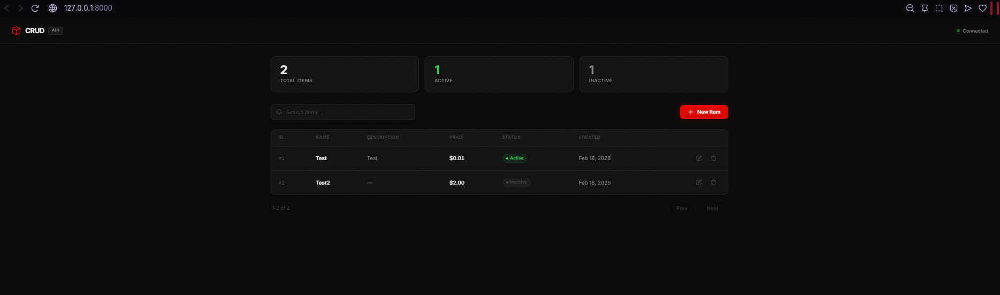
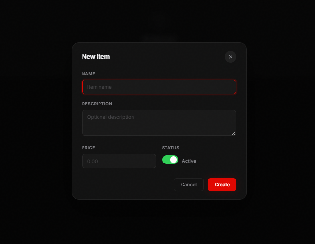
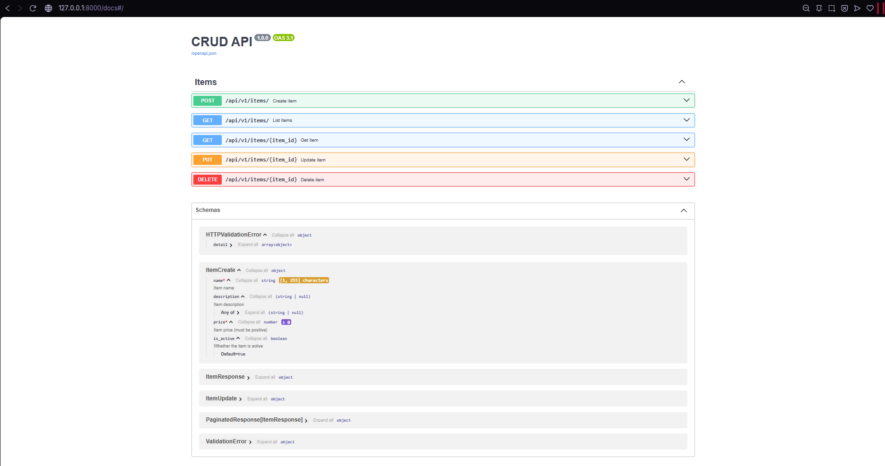

# CRUD API

Generic SOLID CRUD API built with FastAPI + premium dark UI. Designed as a flexible base for any project.

## Screenshots

| Dashboard | Create/Edit Modal |
|---|---|
|  |  |

| Delete Confirmation | Swagger UI |
|---|---|
|  |  |

> Save your screenshots in the `docs/` folder with the names above.

## Tech Stack

| Component | Technology | Purpose |
|---|---|---|
| Framework | FastAPI | Async web framework, auto Swagger |
| ORM | SQLAlchemy 2.0 (async) | Database access with generics |
| Validation | Pydantic v2 | Request/response schemas |
| Migrations | Alembic | Database schema versioning |
| Database | SQLite (dev) / PostgreSQL (prod) | Zero config for dev |
| Frontend | Vanilla HTML + CSS + JS | No build step, served by FastAPI |
| Tests | pytest + pytest-asyncio + httpx | Unit + integration tests |
| Linting | ruff | Fastest Python linter/formatter |
| CI/CD | GitHub Actions | Automated lint + tests + coverage |

## Architecture (SOLID)

```
app/
├── api/v1/endpoints/   # HTTP layer (routes, status codes)
├── services/           # Business logic layer
├── repositories/       # Data access layer (queries)
├── models/             # ORM models (database schema)
├── schemas/            # Pydantic models (validation)
├── core/               # Exceptions, shared utilities
├── db/                 # Engine, session, base model
└── static/             # Frontend (HTML, CSS, JS)
```

Each layer has a single responsibility and depends on abstractions (Protocols), not concrete implementations.

### SOLID Principles

- **S** - Single Responsibility: Each layer handles one concern only
- **O** - Open/Closed: `BaseRepository` and `BaseService` are generic, extend without modifying
- **L** - Liskov Substitution: All repositories/services implement shared Protocols
- **I** - Interface Segregation: `IReadRepository` and `IWriteRepository` are separate
- **D** - Dependency Inversion: Endpoints depend on abstractions via FastAPI `Depends()`

## Quick Start

```bash
# Install dependencies
pip install -e ".[dev]"

# Copy environment file
cp .env.example .env

# Run the server
uvicorn app.main:app --reload
```

| URL | What |
|---|---|
| http://localhost:8000 | Frontend UI |
| http://localhost:8000/docs | Swagger UI |
| http://localhost:8000/redoc | ReDoc |

## Frontend

Dark premium UI inspired by Apple, Nike, and Ferrari:

- Dark theme with Ferrari red accents
- Glass morphism header with backdrop blur
- Inter typography with Apple-style spacing
- Animated table rows and modal transitions
- Stats dashboard (total, active, inactive)
- Search with debounce
- Pagination (10 items/page)
- Create/edit modal with toggle switch
- Delete confirmation modal
- Toast notifications
- Fully responsive

Files: `app/static/index.html`, `app/static/css/style.css`, `app/static/js/app.js`

## API Endpoints

| Method | Route | Description | Status |
|---|---|---|---|
| POST | `/api/v1/items/` | Create a new item | 201 |
| GET | `/api/v1/items/` | List all items (paginated) | 200 |
| GET | `/api/v1/items/{id}` | Get item by ID | 200 |
| PUT | `/api/v1/items/{id}` | Update an item | 200 |
| DELETE | `/api/v1/items/{id}` | Delete an item | 204 |

## Running Tests

```bash
# Run all tests with coverage
pytest

# Run only unit tests
pytest tests/unit/

# Run only integration tests
pytest tests/integration/
```

## Linting

```bash
ruff check .
ruff format .
```

## Adding a New Entity

1. Create model in `app/models/`
2. Create schemas in `app/schemas/`
3. Create repository in `app/repositories/` (extend `BaseRepository`)
4. Create service in `app/services/` (extend `BaseService`)
5. Create endpoints in `app/api/v1/endpoints/`
6. Register router in `app/api/v1/router.py`
7. Add dependency providers in `app/api/v1/dependencies.py`

## Database Migrations

```bash
# Generate a new migration
alembic revision --autogenerate -m "description"

# Apply migrations
alembic upgrade head

# Rollback last migration
alembic downgrade -1
```
